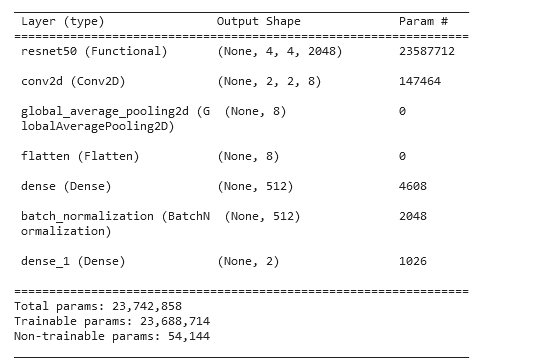
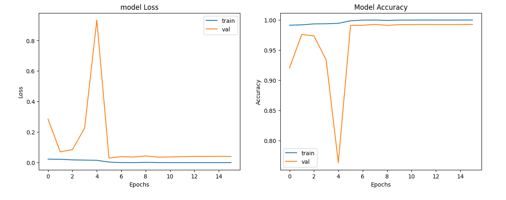

# Deepfake Detection 👁️

We aim to distinguish between real images and AI-generated images, contributing to the fight against disinformation and fraud, but also for fun. Here's why it matters:

AI technology has the potential to create highly convincing fake images, which can be used for malicious purposes. By developing effective AI-generated image detection methods, we can help protect individuals and organizations from falling victim to misinformation and scams. Our project focuses on detecting these AI-generated GAN alterations and enhancing media trustworthiness. 🕵️‍♂️

Pitch link:
[Deepfake Detection Pitch](https://docs.google.com/presentation/d/1y4D4UnabuaEQm8CRmkhLp0dVFm8lmjB40ltkDNpZ3pU/edit#slide=id.g278f5df32ba_1_1017)

Explanation of the dataset:
[140K Real and Fake Faces Dataset](https://www.kaggle.com/datasets/xhlulu/140k-real-and-fake-faces)

This is the link to the repository:
[DeepFakeDetection GitHub Repository](https://github.com/RayVinc/DeepFakeDetection)

This is the link to the web site repository:
[Deepfake Detection Website GitHub Repository](https://github.com/Lebaozki/deepfake-website)

This is the link to the final website:
[Deepfake Detection Web App](https://fakefacedetection.streamlit.app/)

Collaborators:
- @RayVinc
- @Lebaozki
- @MalvinaGP
- @sergioestebanez

# 1️⃣ Local Setup 🏠

## 1.1) Working with a Local Environment Decision 🐍
We are utilizing the Le Wagon environment, with the possibility of requiring additional packages. 📦 This choice is informed by its compatibility with Kaggle, which we are using for data exploration, preprocessing, modeling, and fitting. Kaggle notebooks provide quick access to our data. After this phase, we will transition our code to Python files.

## 1.2) Define the Deepfake Package Structure 📂
Our project's directory structure is designed for organization and easy access. 🧩

```bash
├── DeepfakeDetection        # Main project directory
├── __pycache__              # Compiled Python bytecode files
│   ├── __init__.cpython-310.pyc
├── api                      # Package containing API-related code
│   ├── __pycache__
│   │   ├── __init__.cpython-310.pyc
│   │   └── fast.cpython-310.pyc
│   ├── __init__.py
│   └── fast.py              # API code logic
├── dl_logic
│   ├── __pycache__
│   │   ├── __init__.cpython-310.pyc
│   │   └── model.cpython-310.pyc
│   ├── __init__.py
│   ├── data.py              # Loading train, val and test sets on Kaggle
│   └── model.py             # Deep learning model training logic & loading model
├── models                   # Directory for storing pre-trained models
│   └── past_models          # Directory for storing old pre-trained models
├── __init__.py              # Python package initializer
├── DeepFakeDetection.egg-info
├── notebooks                # Jupyter notebooks directory
│   └── past_versions        # Past versions of notebooks
├── raw_Data                 # Directory for raw data
├── .env                     # Environment configuration file
├── .env.sample              # Sample environment configuration file
├── .env.sample.yaml         # Sample environment configuration file to deploy on Cloud Run
├── .env.yaml                # Environment configuration file to deploy on Cloud Run
├── .envrc                   # directory-specific variables
├── .gitignore               # Git ignore file
├── .python-version          # Python version specifier
├── Dockerfile               # Docker container configuration
├── Makefile                 # Makefile for project tasks
├── README.md                # Project README file
├── requirements.txt         # Project dependencies file
├── setup.py                 # Project setup file
```

# 2️⃣ Data Scientist Approach 🧪

## 2.1) Load Data 📂

### Loading the Dataset

[140K Real and Fake Faces Dataset](https://www.kaggle.com/datasets/xhlulu/140k-real-and-fake-faces)

### Why Kaggle for Data Access
In this project, we leverage the Kaggle platform to access the dataset containing 140,000 real and fake (AI-generated) face images. Kaggle offers several advantages that make it an ideal choice for acquiring and working with data:

  1. Data Accessibility: Kaggle streamlines access to the dataset crucial for this image binary classification task. Effortlessly download, explore, and preprocess data, saving valuable time that can be redirected to refining our image classification models.

  2. Visualization Tools: Kaggle's built-in data visualization tools empower us to gain deeper insights into image datasets.

  3. Collaboration Hub: Kaggle serves as our collaboration hub, connecting us with fellow data scientists and machine learning enthusiasts. We share progress, collaborate on solutions on Git, and benefit from community discussions, kernels, and notebooks.

  4. Diverse Image Datasets: Kaggle offers a diverse range of image datasets, from small-scale samples to extensive collections. This variety enables us to experiment with different data sources, enhancing the robustness of our image classification models.

  5. Efficient Coding: Kaggle Kernels provide an efficient coding environment, eliminating the need for complex local setups. We can code, run, and share our image classification solutions seamlessly, promoting collaboration and reproducibility.


## Step 1: Dataset Preparation
Before loading the dataset, ensure you've downloaded it from Kaggle and organized it in your project directory. The dataset should contain two folders: one for fake images and another for real images. Proper organization is crucial for accurate label assignment during data loading.

## Step 2: Exploring the Loaded Data
Upon running the provided code using 'ImageDataGenerator().flow_from_directory()' funtion, we'll create labeled datasets for fake and real images. These labels are essential for supervised deep learning tasks, such as deepfake detection. Additionally, the function inherently batches your data, which is advantageous for efficient model training and evaluation.

# 2.2) Exploratory Data Analysis 🔍

## Understanding the Dataset
In this section, we'll delve into an exploratory data analysis (EDA) of the dataset sourced from Kaggle: 140K Real and Fake Faces Dataset. This dataset comprises a unique combination of real and fake face images, making it an intriguing resource for deepfake detection and related tasks.

### Dataset Composition
The dataset encompasses two main components:

  1. Real Faces: This subset comprises 70,000 real faces, which were extracted from the Flickr dataset collected by Nvidia. These images represent authentic human faces and serve as a valuable benchmark for distinguishing real and fake images.

  2. Fake Faces: The other 70,000 images are synthetic faces generated by StyleGAN, a powerful AI model. These fake faces were sampled from the 1 Million FAKE faces dataset provided by Bojan. They represent AI-generated facial images and challenge the robustness of deepfake detection algorithms.

### Data Preprocessing
To facilitate analysis and modeling, the dataset has undergone preprocessing steps, including:

  1. Image Resizing: All images have been uniformly resized to 128 pixels, ensuring consistent dimensions for analysis and model training.

  2. Data Split: The dataset has been partitioned into train, validation, and test sets, which are essential for training and evaluating machine learning models effectively.

### Gain insights into the distribution of real and fake images.
Explore any patterns or variations in the dataset.
Identify potential challenges or biases that may influence model performance.
By understanding the dataset's characteristics and nuances, you'll be better equipped to make informed decisions when designing your deepfake detection model and preprocessing strategies.

# 2.3) Baseline Score and Model 📊

## The Baseline Model
For our baseline, we're using a simple architecture known as a Convolutional Neural Network (CNN). In plain English, a CNN is a type of neural network designed specifically for image-related tasks. Imagine it as a stack of filters that slide over an image, recognizing patterns and features like edges, textures, and shapes.

In our baseline model, we have a few convolutional layers to extract these features, followed by some fully connected layers to make predictions. It's a relatively straightforward architecture, and you can find the detailed implementation in our notebook (see in notebook).

## Baseline Model Performance
Our baseline model's performance is measured using a metric called val_accuracy, which represents the accuracy of predictions on a validation dataset. We expect this accuracy to be around 0.5 to 0.55 for our baseline model. This means that the model correctly classifies approximately 50% to 55% of the images in the validation set.

It's important to note that this accuracy is relatively low, which is expected for a simple baseline model. Our goal is to build more advanced models that significantly outperform this baseline and achieve higher accuracy in detecting deepfake images.

By establishing this baseline score and understanding the basic model architecture, we can better assess the progress and effectiveness of our more sophisticated deepfake detection models as we continue to develop and refine them.

# 2.4) Researching the Best Model 🧠

## The Quest for the Optimal Model
In the journey towards developing an effective deepfake detection system, it's imperative to explore various machine learning models. We seek to discover the best-performing model that can distinguish between real and fake images with the highest accuracy. This process involves researching, testing, and fine-tuning different architectures and techniques to achieve superior results.

Our approach involves trying out state-of-the-art models and custom architectures, comparing their performance, and selecting the one that best suits the project's goals. This iterative process allows us to continually improve the model's accuracy and robustness in detecting deepfake images.

# 2.5) Architectural Model 🏗️

## Model Architecture Overview
Our chosen model architecture is based on the ResNet50 architecture, a widely recognized deep convolutional neural network. This architecture has been pretrained on the ImageNet dataset and is known for its ability to capture complex image features.

Here's a high-level overview of our model architecture:

  1. ResNet50 Backbone: We use a pre-trained ResNet50 as the backbone of our model. This part of the model extracts meaningful features from input images.

  2. Additional Layers: Following the ResNet50 backbone, we add a series of additional layers, including a convolutional layer, global average pooling layer, and a flatten layer. These layers further process the extracted features.

  3. Dense Layers: We have two dense layers with 512 units each, followed by batch normalization for improved training stability.

  4. Output Layer: The final dense layer consists of 2 units with softmax activation, representing our binary classification problem (real or fake).

Our model is compiled using the Adam optimizer with a learning rate of 0.001 and categorical cross-entropy loss, which is appropriate for binary classification tasks.

The summary of the model's architecture and its parameters is displayed below:



This architectural model forms the foundation for our deepfake detection system and will undergo further experimentation and fine-tuning as we proceed with the project.

# 2.6) Evaluate Model 📈


The model stabilizes quickly after an initial experimentation phase and will not significantly increase in accuracy when run for more epochs

# 2.7) Fine-tuning 🛠️
We played with a number of layouts and hyperparameters. The goal was to increase accuracy.

# 2.8) Extra Data 📚
In our pursuit of creating an effective deepfake detection system, we left no stone unturned. This included experimenting with data augmentation techniques and adding extra layers to our model architecture. Here's a brief overview of our exploration:

### Data Augmentation 🔄
We leveraged tools like Roboflow to explore data augmentation possibilities. Data augmentation involves applying various transformations to the training data to artificially increase its diversity. This can include rotations, flips, zooms, and more. The goal is to expose our model to a wider range of variations it might encounter in real-world scenarios.

### Additional Layers in Model 🧱
We considered adding extra layers to our model architecture to make it more complex and potentially more capable of capturing intricate features in the data. This could involve increasing the depth of the neural network, adding more convolutional layers, or experimenting with different activation functions. We also tried to simplify it until the accuracy decreased.

### Achieving Good Results Early On 🎯
One notable outcome of our experimentation was that we achieved promising results relatively early in the project. Our baseline model, as well as some early iterations with minimal data augmentation and layers, exhibited strong performance in distinguishing between real and fake images.

## 2.9) Model Interpretability 🤖
Given the good results achieved without the need for extensive data augmentation or additional layers, we made a pragmatic decision. We chose to maintain a simpler and more interpretable model architecture. This approach not only ensures computational efficiency but also reduces the risk of overfitting and makes the model easier to fine-tune and deploy.

By making this decision, we can maintain a balance between model complexity and performance, allowing us to focus on other aspects of the project, such as model interpretability, explainability, and ethical considerations.

# 3️⃣ Web App Development 🌐

## 3.1) Web App Framework 🧩
We have developed a web application for deepfake detection, providing users with an intuitive interface to upload and analyze images. The web app is built using Streamlit, a Python library that simplifies web app development and data visualization.

### Why Streamlit
Streamlit offers several advantages for our web app development:

  1. Rapid Prototyping: Streamlit allows us to quickly create interactive web apps using Python scripts. This accelerated development speed is crucial for delivering a functional app within project timelines.

  2. Data Integration: Streamlit seamlessly integrates with data science libraries like Pandas and Matplotlib, making it easy to display data, charts, and results within the app.

  3. User-Friendly: The simplicity of Streamlit's API and widgets makes it accessible to users with varying technical backgrounds. Users can upload images, and the app provides clear results, enhancing user engagement.

  4. Customization: While Streamlit is beginner-friendly, it also offers customization options for more advanced users. We can style and configure the app to match the project's branding and requirements.

### Web App Features
Our deepfake detection web app includes the following features:

  1. Image Upload: Users can upload their own images for analysis.
  2. Real/Fake Prediction: The app predicts whether the uploaded image is real or fake, providing a confidence score.
  3. Confidence Threshold: Users can set a confidence threshold to determine the level of certainty required for a prediction.

## 3.2) Running API in the cloud 🔨
The API is based on FastAPI.
There are 2 endpoints
- GET: /. Returns 'status: ok' if API running.
- POST: /upload_image. It takes an image as input and the response is a list of 2 probabilities (eg: [0.99, 0.01]). [1,0] is a 100% fake image and [0, 1] is a 100% real image.

Note: If you are on Mac or Linux, change the base image in the dockerfile.

## 3.3) Deployment 🚀
We have deployed our web app using streamlit and Google Run Cloud API.
Deployment Link: [Deepfake Detection Web App](https://fakefacedetection.streamlit.app/)

## 3.3) User Guide 📖
How to Use the Deepfake Detection Web App
Our deepfake detection web app is designed to be user-friendly and intuitive. Follow these steps to use the app effectively:

  1. Access the Web App: Visit the following link to access the deepfake detection web app: Deepfake Detection Web App

  2. Upload an Image: Click the "Upload Image" button to select an image from your device. The app supports various image formats, including JPEG, PNG, and GIF.

  3. Prediction: After uploading an image, the app will process it and provide a prediction regarding whether the image is real or fake. The prediction will include a confidence score.

  4. Upload Another Image: To analyze additional images, click the "Upload Image" button again and repeat the process.

  7. Enjoy and Share: Explore the app's functionality, share it with others, and use it to detect deepfake images for various purposes, from educational awareness to verifying image authenticity.

The deepfake detection web app is a valuable tool for identifying AI-generated images and promoting media trustworthiness. It's designed to be accessible to a wide range of users, whether they have technical expertise or not.

## 3.4) Future Improvements 🌟
Our deepfake detection web app is a dynamic project with the potential for further enhancements. Here are some ideas for future improvements:

### 3.4.1) Model Updates
Continuously update the deepfake detection model to improve accuracy and robustness. Stay informed about the latest advancements in deepfake generation techniques and adapt the model accordingly.

### 3.4.2) User Feedback
Collect user feedback and suggestions for improving the web app's usability and features. User input can help prioritize enhancements that align with user needs.

### 3.4.3) Educational Resources
Incorporate educational resources within the web app to raise awareness about deepfake technology, its implications, and methods for identifying deepfake content.

### 3.4.4) Integration with Social Media
Explore options for integrating the deepfake detection tool with social media platforms to provide real-time deepfake detection for shared content.

### 3.4.5) Mobile App
Consider developing a mobile app version of the deepfake detection tool to reach a broader audience and provide on-the-go image analysis.

## 3.5) Ethical Considerations 🌐
As creators of a deepfake detection tool, we are committed to ethical practices in AI and image analysis. Here are some ethical considerations we've taken into account:

### 3.5.1) Privacy
Respect user privacy by ensuring that uploaded images are not stored or used for any other purposes beyond analysis. Clearly communicate the app's data usage policy to users.

### 3.5.2) Transparency
Provide clear and transparent explanations for predictions to help users understand how the model arrived at its decisions. Transparency builds trust and accountability.

### 3.5.3) Bias Mitigation
Continuously monitor and mitigate biases in the model to ensure that it does not produce discriminatory or unfair results. Implement techniques such as fairness audits and bias correction.

### 3.5.4) User Education
Include educational resources within the app to inform users about the existence of deepfake technology and how to critically assess media content.

### 3.5.5) Responsible Disclosure
Encourage responsible disclosure of deepfake content. Provide users with guidance on reporting and addressing deepfake-related issues.

3.6) Conclusion 🎉
Our deepfake detection project represents a significant step towards countering the spread of AI-generated fake content. By developing an accurate and accessible deepfake detection model and web app, we empower users to identify and verify the authenticity of images in various contexts.

This project is an ongoing effort, and we remain dedicated to improving the model's performance, expanding its features, and upholding ethical standards in AI and image analysis. Together, we can contribute to a safer and more trustworthy digital landscape.

Thank you for joining us on this journey to combat deepfake technology and promote media integrity.

Collaborators:
- @RayVinc
- @Lebaozki
- @MalvinaGP
- @sergioestebanez
